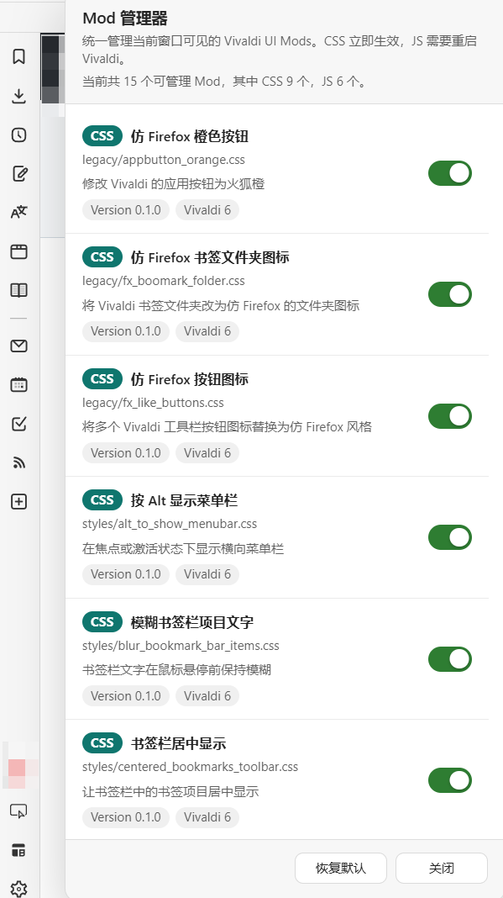

# VivaldiMods

Vivaldi 自定义内容收藏夹

目前我的 Vivaldi 版本：**7.9.3970.50** 

## userChrome.js

Vivaldi 的 UC Loader(UC 环境)，用于载入`.css`和`.ac.js`。我出于私心命名为`userChrome.js`了

### 安装方法

### 手动

1. 下载本仓库

2. 然后把所有内容都放到`Vivaldi安装目录\版本号（比如6.2.3105.58）\resources\vivaldi`下

3. 修改`window.html`，在`</body>`后面加入`<script src="chrome/userChrome.js"></script>`

### 自动（仅 Windows）

1. 下载本仓库
2. 双击 installhooks.bat
3. 如果提示找不到 vivaldi 路径可以手动指定 vivaldi.exe 路径，先右键并点击**在此处打开命令提示符**，然后执行下面的命令（假设你的 Vivaldi 安装到 D:\Soft\Vivaldi）
   
   ```batch
   installhoot.bat "D:\Soft\Vivaldi\Application\vivaldi.exe"
   ```

## Mod 管理器

### 功能特性

`modsManager.ac.js` 提供了统一的 Mod 管理界面，具备以下功能：

- **统一管理**：集中管理所有 CSS / JS Mods 的启用状态
- **可视化操作**：友好的图形界面，一键切换 Mod 启用/禁用
- **智能生效**：CSS 修改立即生效，JS 修改提示需重启 Vivaldi
- **状态持久化**：Mod 启用状态自动保存，重启后保持
- **恢复默认**：一键恢复所有 Mod 到默认状态

### 使用方法

安装完成后，会在侧边栏工具栏显示管理器按钮（窗口分栏图标），点击按钮即可打开管理面板。

### 界面预览



### 技术说明

- CSS Mod 状态变更会实时应用到当前窗口，无需重启
- JS Mod 状态变更需要重启 Vivaldi 才能生效（管理器会提示）
- 状态数据存储在 Vivaldi 本地存储中，确保持久化
- 通过 `window.userChrome_js` API 与 UC 环境交互

## userChrome.js

userChrome.js 提供了额外的`$`函数，操作 DOM 可以方便一点

## 题外话

### 为什么脚本后缀名为 .ac.js

与 .uc.js 和 userscript 区分